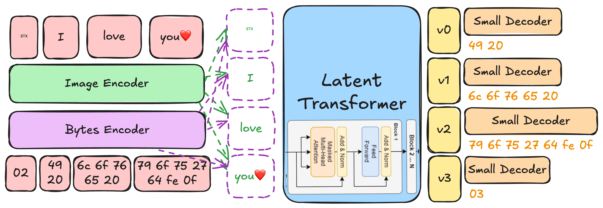

# Image Latent Transformer (ILT)


[](./LICENSE)
 
[See Motivational Examples](./MOTIVATION.md)

We present a language model that replaces conventional subword tokenization with a dual representation of text as 
both bytes and rendered images of "words", allowing the model to directly process the visual and symbolic 
structure of language. It segments text into whitespace-delimited units, encodes each as images and byte sequences, 
and passes them through an encoder–decoder pipeline: 
a bytes encoder, an image encoder, a large latent transformer, and a bytes decoder. 
At inference, predicted bytes are rendered back into images, closing the loop for the next prediction.
This design could make learning and inference cheaper and faster for non-English languages, 
since the heavy latent transformer only predicts high-level token representations while the actual byte 
sequences are generated by a much smaller decoder.



## Quick Start

Clone and setup:

```shell
git clone https://github.com/sign/image-latent-transformer.git
cd image-latent-transformer
```

Install dependencies:

```shell
conda create -n ilt python=3.12 -y
conda activate ilt
conda install -c conda-forge pycairo pygobject manimpango -y
pip install ".[dev]"
```

Or using docker:

```shell
docker build -t ilt .
docker run -it --rm ilt /bin/bash
```

> [!TIP]
> Run tests using `pytest` to ensure everything is working correctly.

## Model Setup

- **Bytes Encoder** - You can use any language model as the bytes encoder (causal or masked).
- **Image Encoder** - You can use any image encoder.
- **Latent Transformer** - You can use any causal LM (recommended: large).
- **Bytes Decoder** - You can use any causal LM (recommended: small).

For language models, the parameter count is lower than reported, due to removing the embedding layers.

Our implementation allows for any mix-and-match. Some example setups are:

| Name   | Bytes Encoder                                                                | Image Encoder                                                                                             | Latent Transformer                                                    | Bytes Decoder                                                             | Total Parameters |
|--------|------------------------------------------------------------------------------|-----------------------------------------------------------------------------------------------------------|-----------------------------------------------------------------------|---------------------------------------------------------------------------|------------------|
| tiny   | [bert-tiny](https://huggingface.co/prajjwal1/bert-tiny) (0.5m)               | [vit-tiny-patch16-224](https://huggingface.co/WinKawaks/vit-tiny-patch16-224) (5m)                        | [pythia-70m](https://huggingface.co/EleutherAI/pythia-70m) (19m)      | [tiny-lm](sbintuitions/tiny-lm) (3m)                                      | 28m              |
| small  | [ModernBERT-base](https://huggingface.co/answerdotai/ModernBERT-base) (111m) | [swinv2-tiny-patch4-window16-256](https://huggingface.co/microsoft/swinv2-tiny-patch4-window16-256) (27m) | [gemma-3-270m](https://huggingface.co/google/gemma-3-270m) (100m)     | [SmolLM2-135M](https://huggingface.co/HuggingFaceTB/SmolLM2-135M) (106m)  | 346m             |
| medium | [deberta-v3-large](https://huggingface.co/microsoft/deberta-v3-large) (303m) | [clip-vit-base-patch32](https://huggingface.co/openai/clip-vit-base-patch32) (87m)                        | [Llama-3.2-1B](https://huggingface.co/meta-llama/Llama-3.2-1B) (973m) | [gpt2-medium](https://huggingface.co/openai-community/gpt2-medium) (304m) | 1,674m           |

To turn off bytes encoding, set `bytes_encoder=False`, and similarly for images, set `image_encoder=False`.
You can also turn off a specific encoder after training has completed, for testing purposes.

> [!WARNING]  
> In implementation of the bytes decoder, we concatenate the embeddings of the bytes of the current token with
> all the embeddings of the previous tokens (on the word level). This is done since not all causal LMs support
> cross-attention, and so we want to avoid using it, and rely on the self-attention mechanism instead.

## Training

Training instructions are available in the [training/README.md](./training/README.md).
There, you can select the model architectures you want to use for each component, and the dataset you want to train on.

## Inference

> [!CAUTION]
> Our text [renderer](./image_latent_transformer/renderer.py) relies on the computer's font rendering capabilities.
> Rendering on different systems may yield different results (e.g. emoji).
> We call the community to create a more robust renderer, decoupled from the system's font rendering,
> for better consistency across platforms and easier reproducibility.

Since we have two decoders, the autoregressive prediction logic is a bit more complex than the usual,
and supporting decoding algorithms like beam-search is not trivial.

Thus, on the latent-transformer level,
[we only support greedy decoding](https://github.com/sign/image-latent-transformer/issues/5) for now.
On the bytes decoder level, we support all classical decoding algorithms supported by HuggingFace Transformers.

## Contributing

See [open issues](https://github.com/search?q=repo%3Asign%2Fimage-latent-transformer+%22%2Fissues%2F%22&type=code) 
and [TODOs](https://github.com/search?q=repo%3Asign%2Fimage-latent-transformer%20TODO&type=code) in the codebase.

> [!WARNING]
> Training runs are experimental until core issues are resolved.

## Cite

If you use this code in your research, please consider citing the work:

```bibtex
@misc{moryossef2025ilt,
  title={Language Modeling with Text as Images},
  author={Moryossef, Amit},
  howpublished={\url{https://github.com/sign/image-latent-transformer}},
  year={2025}
}
```